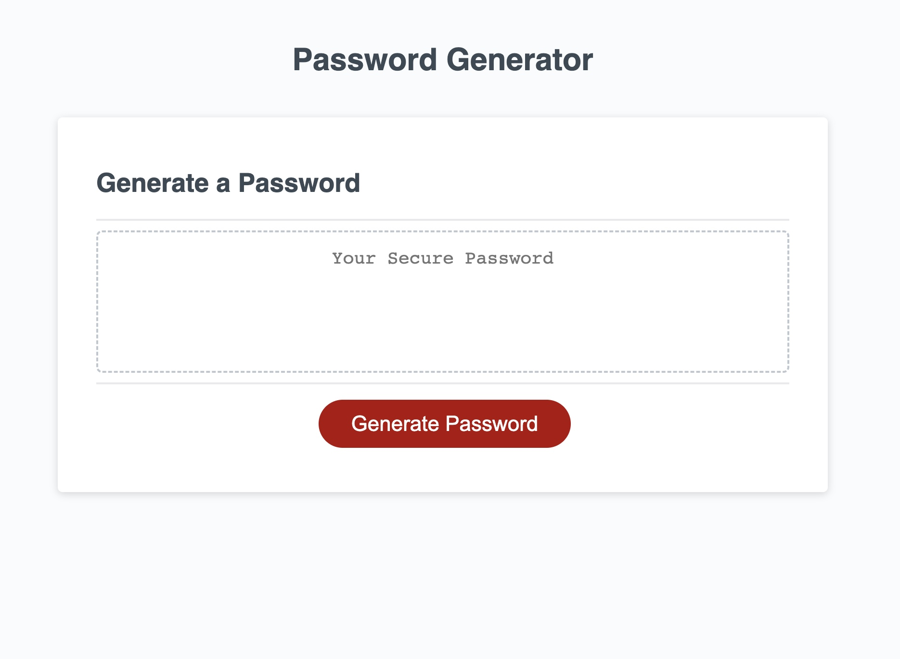

# Password Generator

## Description

This application creates a password between 8-128 characters. The password can include uppercase letter, lowercase letters, numeric characters and special characters. After the user is prompted for their required criteria, the password is displayed. 

[Link to Password Generator](https://kthames.github.io/PasswordGenerator/)

## Authors

Katherine Thames - k.thames@me.com

## Version History

* 0.2
    * Update README file.
* 0.1
    * First push of code.

